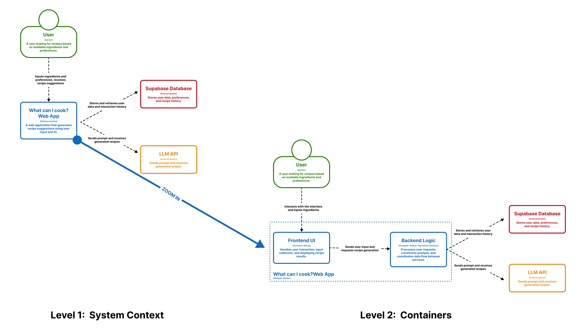
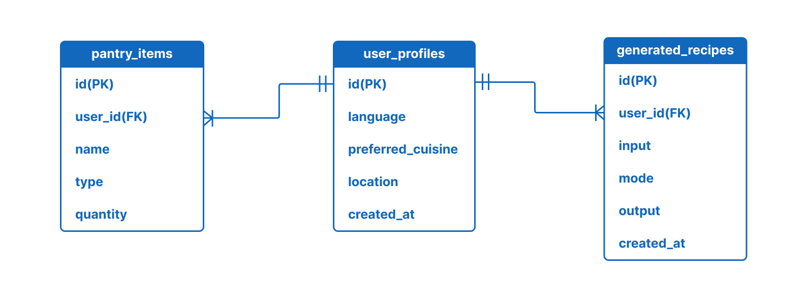

# 🧠 Architecture Overview

This document describes the system architecture of *What Can I Cook?*, an AI-powered web application that generates recipe suggestions based on available ingredients.

The system is designed to be simple, modular, and AI-centric. It focuses on enabling fast iteration while maintaining a clear separation between user interaction, data management, and AI-powered generation.

---

## 🗺️ C4 Diagram

The user interacts with a web application that manages data (Supabase) and communicates with an LLM API to generate recipes.  
The system is internally divided into frontend UI and backend logic.

---

## 🧩 Data Model

The system is centered around `user_profiles`. Each user can have multiple pantry items and generated recipes, connected via `user_id`.

---

## ⚙️ Tech Stack Justification

The system is designed to be lightweight, fast to iterate, and well-suited for AI-powered features.

**Frontend (Next.js)**  
Next.js is used to build the user interface due to its strong support for rapid prototyping, component-based design, and seamless integration with APIs. It enables efficient development of interactive features such as ingredient input and recipe display.

**Backend (Serverless Functions / API Layer)**  
A lightweight backend layer is used to handle request processing, prompt construction, and communication with external services. This approach avoids unnecessary complexity while keeping the system scalable and easy to maintain.

**Database (Supabase / PostgreSQL)**  
Supabase provides a managed PostgreSQL database with built-in APIs, making it ideal for storing user profiles, pantry items, and recipe history. It reduces backend overhead and allows quick integration with the frontend.

**AI Service (LLM API)**  
An external LLM API is used to generate recipes based on user input. This enables flexible and high-quality content generation without building custom models, allowing the system to focus on prompt design and user experience.

Overall, the chosen stack prioritizes simplicity, fast development, and strong support for AI-driven functionality.

## 🤖 Agentic Engineering Plan

This project follows an AI-first development workflow, where large language models are used as active collaborators throughout the engineering process.

**1. Issue-Driven Development**  
Each feature is defined as a GitHub Issue with clear, testable acceptance criteria. Development progresses by implementing one issue at a time.

**2. AI-Assisted Implementation**  
Tools such as Cursor and Claude Code are used to generate, refine, and debug code. The developer provides high-level intent, while the AI assists with implementation details.

**3. Prompt-Centric Design**  
Special attention is given to prompt construction for the LLM. The backend focuses on structuring user input into effective prompts to ensure high-quality recipe generation.

**4. Iterative Testing and Refinement**  
Features are tested incrementally after each implementation. AI tools are also used to identify edge cases, improve logic, and refine outputs.

**5. Lightweight Architecture Decisions**  
Instead of over-engineering, the system favors simple and modular components. AI tools are leveraged to accelerate development without introducing unnecessary complexity.

This approach allows rapid iteration, efficient development, and strong alignment with the project’s AI-driven nature.