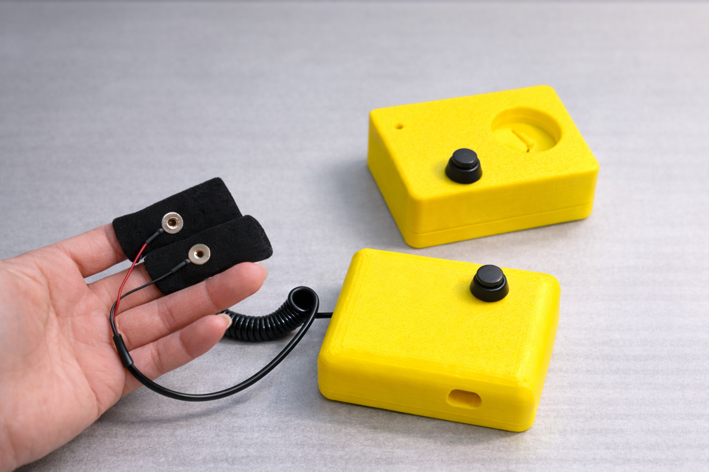
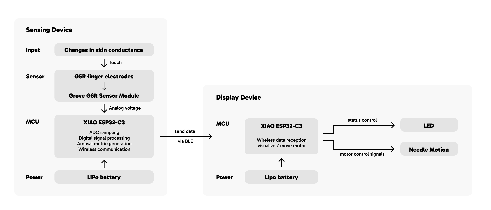
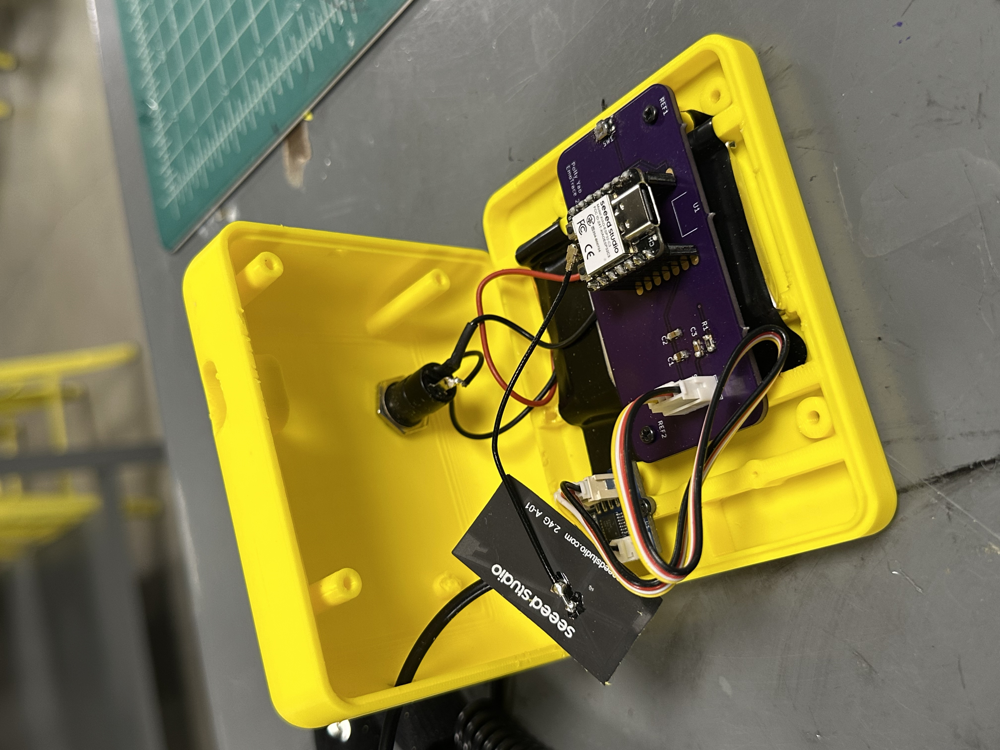
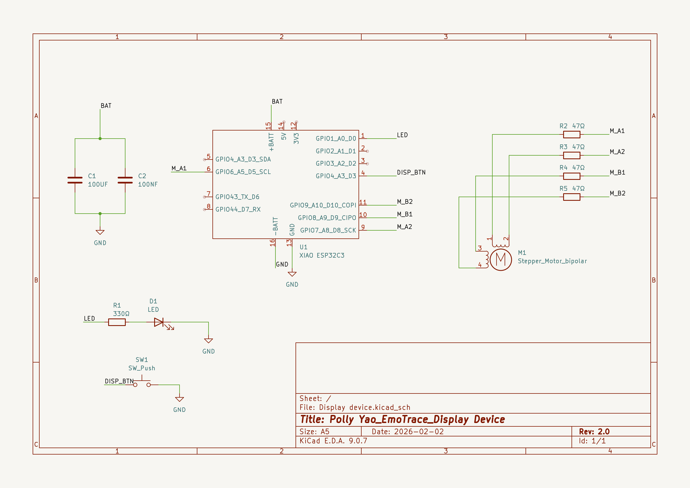
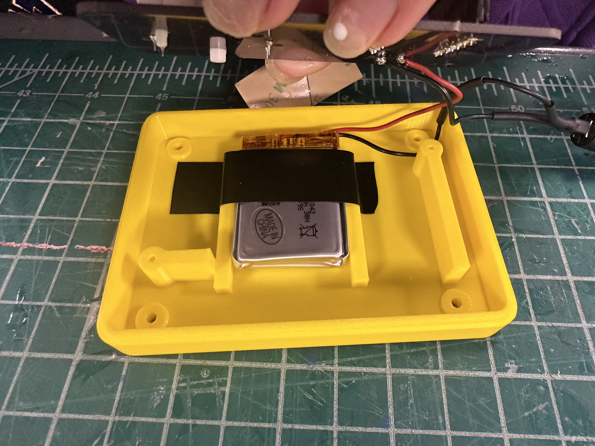
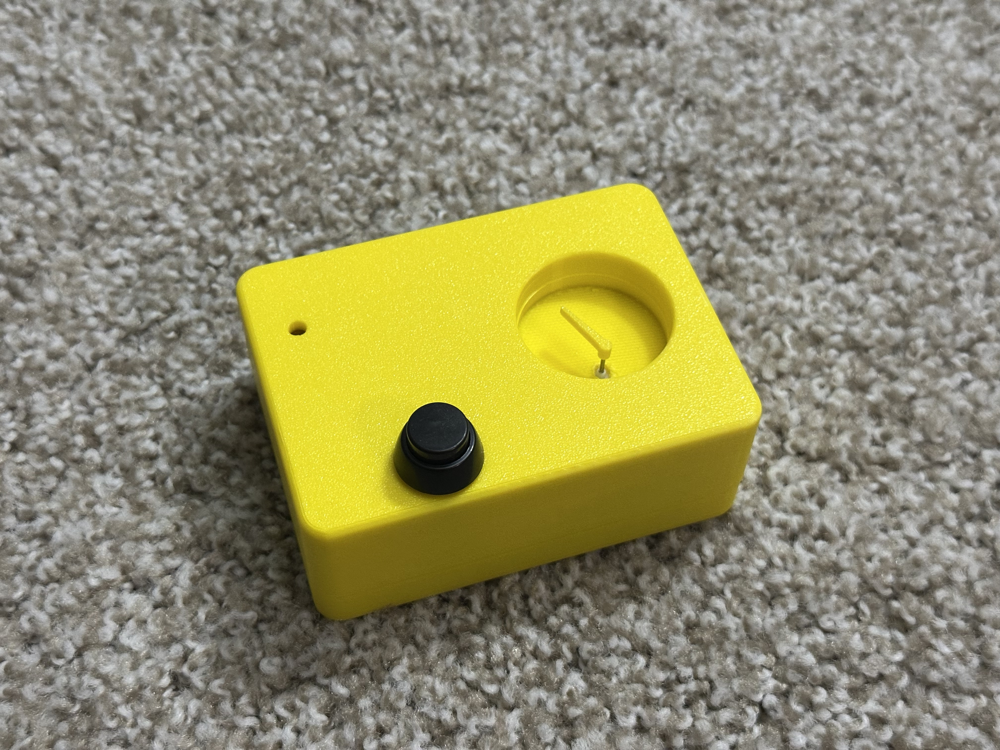
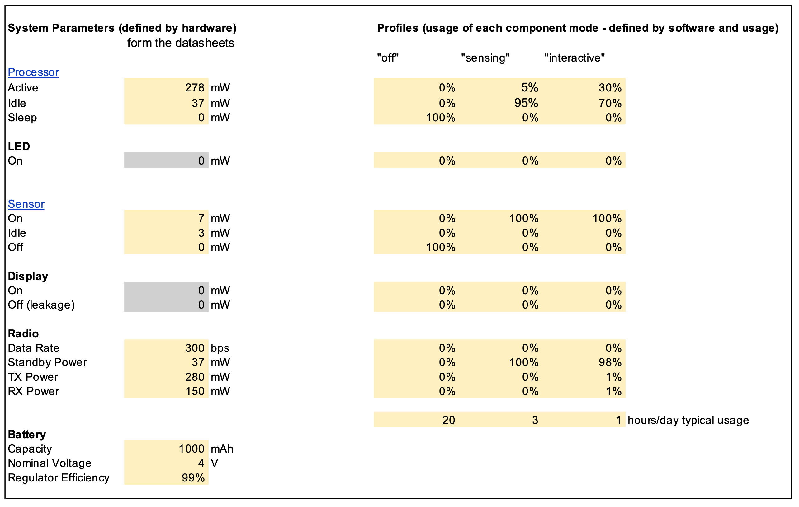
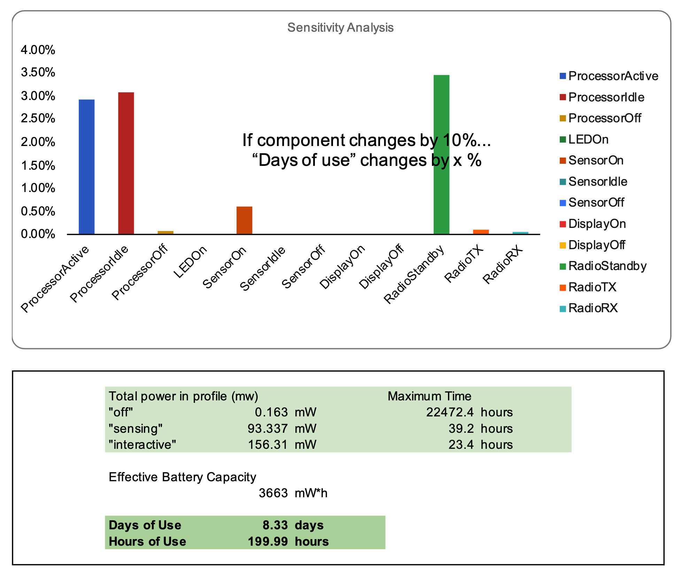
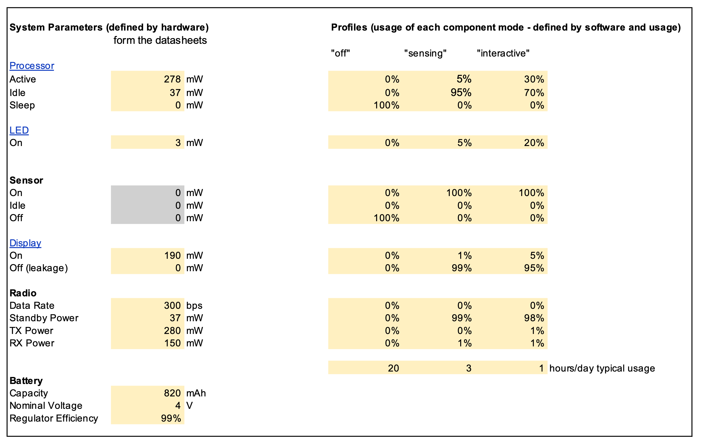
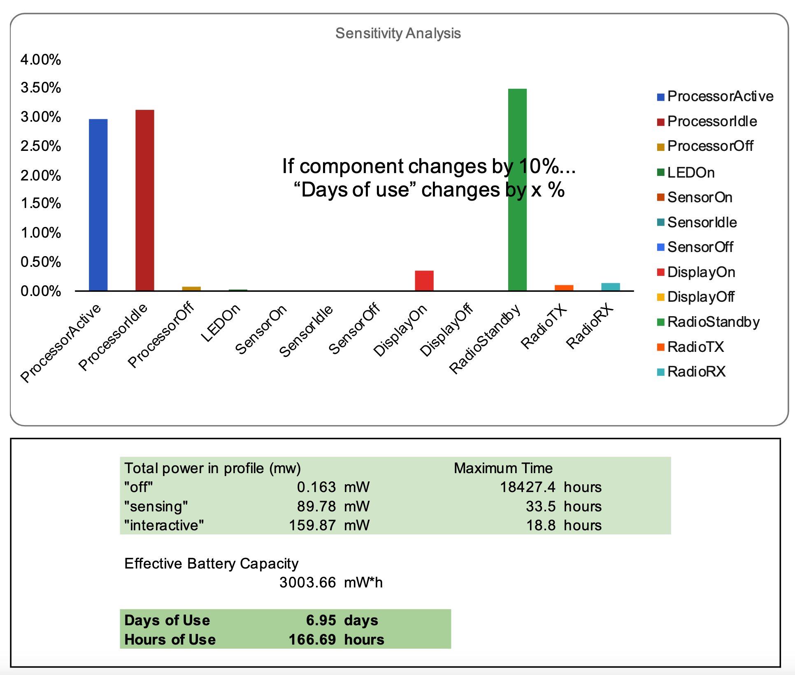

# EmoTrace
#### MSTI TECHIN 514 Final Project           
#### 01/06/2026-03/06/2026

# OVERVIEW
## One Sentence Explanation
EmoTrace uses GSR to sense physiological arousal and express a person’s current emotional state in real time.

## Problem being Solved
Emotion is a continuously changing internal state, but it is difficult to observe directly. Most of the time, we only understand our emotions afterward, through memory or language, rather than seeing how they change in the moment.

If emotional states could be __externalized__, they might become something that both the individual and others can notice in real time.

## The Proposed Solution
EmoTrace measures physiological arousal through galvanic skin response (GSR) and expresses these changes using a stepper-motor-driven physical needle.

The system consists of two physically separated devices connected wirelessly via BLE: a sensing device, which captures and processes physiological signals, and a display device, which translates these signals into slow mechanical movement.

This separation allows the relationship between the person being sensed and the person observing the display to remain flexible. They can be the same person or different people. In this way, emotional states are externalized as a physical trace that can be noticed and reflected upon.

## Working Video

[Watch the demo video](https://drive.google.com/file/d/1t5GnzGR31K_5sYIAPt7pJoVDXnYhjY41/view?usp=sharing)

## System Architecture

# SENSING DEVICE
## BOM
- 1 * [XIAO ESP32S3](https://www.digikey.com/en/products/detail/seeed-technology-co-ltd/113991054/16652880?gclsrc=aw.ds&gad_source=1&gad_campaignid=20243136172&gbraid=0AAAAADrbLljlYbHqSh6BivUkmcKZk_tfR&gclid=Cj0KCQiA2bTNBhDjARIsAK89wlEAbbqQBA1uiTFchNcTVx1v-IYc5QwWnkXJ3tXnoyRxEMDE1-QkA1gaAj_BEALw_wcB)
- 1 * [1000mAh Lipo battery](https://www.digikey.com/en/products/detail/adafruit-industries-llc/258/5054544?gclsrc=aw.ds&gad_source=1&gad_campaignid=20243136172&gbraid=0AAAAADrbLljrZZ4GojVo81Kz5tQ6T5lew&gclid=Cj0KCQiA2bTNBhDjARIsAK89wlHKBVgdu98wbLI4JhGyajQuXtPkNRFbFXGNXkboarXHAsTlsZbrKu0aAoZMEALw_wcB)
- 1 * [Grove GSR Sensor](https://www.digikey.com/en/products/detail/seeed-technology-co-ltd/101020052/5488086?gclsrc=aw.ds&gad_source=1&gad_campaignid=20243136172&gbraid=0AAAAADrbLljrZZ4GojVo81Kz5tQ6T5lew&gclid=Cj0KCQiA2bTNBhDjARIsAK89wlEdbELj8x1JB5SEK7N4LNacQjjan1omI9O5Sp8hX23WNFHvLMMLuBQaAk0WEALw_wcB)
- 1 * [SPST Round Push Button Switch](https://www.walmart.com/ip/SPST-MOMENTARY-ON-PUSH-BUTTON-SWITCH-ROUND/166980349?wmlspartner=wlpa&selectedSellerId=101038392)
- SMD resistors and capacitors
- Several JST connectors
- 3D printing enclosure

## Schematic Diagram

## Gallery

# DISPLAY DEVICE
## BOM
- 1 * [XIAO ESP32S3](https://www.digikey.com/en/products/detail/seeed-technology-co-ltd/113991054/16652880?gclsrc=aw.ds&gad_source=1&gad_campaignid=20243136172&gbraid=0AAAAADrbLljlYbHqSh6BivUkmcKZk_tfR&gclid=Cj0KCQiA2bTNBhDjARIsAK89wlEAbbqQBA1uiTFchNcTVx1v-IYc5QwWnkXJ3tXnoyRxEMDE1-QkA1gaAj_BEALw_wcB)
- 1 * [820mAh Lipo battery](https://www.digikey.com/en/products/detail/adafruit-industries-llc/258/5054544?gclsrc=aw.ds&gad_source=1&gad_campaignid=20243136172&gbraid=0AAAAADrbLljrZZ4GojVo81Kz5tQ6T5lew&gclid=Cj0KCQiA2bTNBhDjARIsAK89wlHKBVgdu98wbLI4JhGyajQuXtPkNRFbFXGNXkboarXHAsTlsZbrKu0aAoZMEALw_wcB)
- 1 * [Stepper motor gauge](https://www.adafruit.com/product/2424)
- 1 * [SPST Round Push Button Switch](https://www.walmart.com/ip/SPST-MOMENTARY-ON-PUSH-BUTTON-SWITCH-ROUND/166980349?wmlspartner=wlpa&selectedSellerId=101038392)
- SMD leds,resistors and capacitors
- 3D printing enclosure

## Schematic Diagram

## Gallery

# BATTERY CONSIDERATIONS
Each device is powered by a LiPo battery with __a physical switch__ that can completely cut power to the ESP32, while __the onboard charging circuit__ allows the ESP32 to recharge the battery via USB; additionally, both devices implement __multiple operating states__ (off, monitoring/active for sensing and off, scanning/displaying for display) with light-sleep behavior to minimize continuous power consumption.

## Sensing Device

Spreadsheet link:  
https://1drv.ms/x/c/3520740a59bca320/IQDMDjtJkVfMQYsOUzpoie-YAZGBVunHImL63yKkG8l4-dY?e=yHCJq8

## Display Device

Spreadsheet link:  
https://1drv.ms/x/c/3520740a59bca320/IQBtffllcoQcSJlxG03brPWNAZ11j2MDRlCTxOjXR5vgqAk?e=tpQcXu

# BUDGET SUMMARY
| Component | Price |
|-----------|-------|
| Grove GSR Module | $32.99 / $36.69 |
| CQRobot JST PH 2.0 mm Pitch Connector Kit | $6.99 / $7.71 |
| EVQ-P7A01P | $0.56 |
| ESP32C3 | $4.99 |
| **Total** | **$49.95** |

# FUTURE WORK
- Improved enclosure and interaction design
Develop a more refined enclosure with better integration of the charging port, button, and LED indicators, moving beyond the current PCB housing toward a more intentional human–device interaction.

- Multi-sensor emotional sensing
Incorporate additional physiological sensors to capture emotional states from multiple signals rather than relying solely on GSR.

- More robust signal processing
Improve data processing and filtering methods so that emotional changes are translated into clearer and more stable physical motion.

- Cost optimization
Explore alternative sourcing platforms to reduce the overall hardware cost of the system.